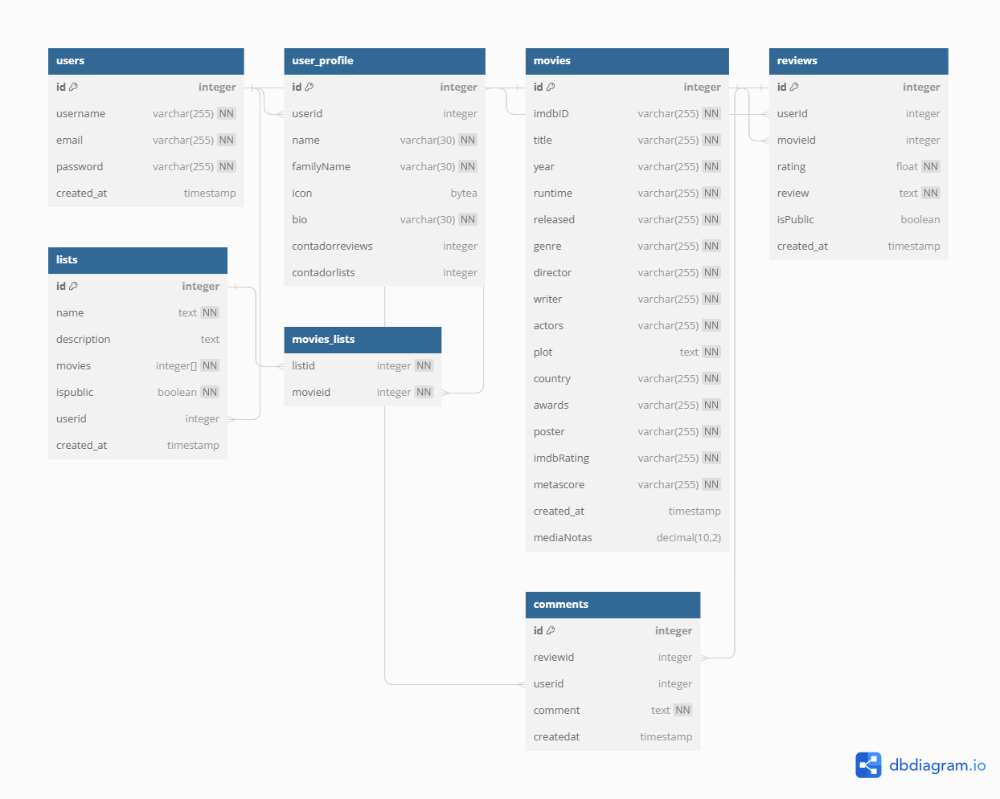

# CritiX - API de avalição de filmes

Este projeto é uma plataforma para avaliação de filmes, permitindo que os usuários compartilhem suas opiniões e classifiquem filmes.
## Tech Stack
- Linguagem de programação: JavaScript
- Backend: Node.js
- Framework web: Express.js
- Banco de dados: Postgresql
- Linguagem de consulta ao banco de dados: Structured Query Language (SQL)
- Biblioteca ORM: Mongoose
- Autenticação: JSON Web Token (JWT)
- Testes de unidade: Jest
- Gerenciador de pacotes: npm


## Instalação local

### Requisitos
Antes de executar este projeto, verifique se o seu ambiente atende aos seguintes requisitos:

```Node.js (versão 12 ou superior)```

```Banco de dados Postgresql```

Agora você pode prosseguir com as etapas de instalação local.


### Clonando o projeto
```bash
  git clone https://github.com/IanOliveiraSilva/CritiX
```
### Configure o banco de dados:
- Certifique-se de ter o PostgreSQL instalado e configurado corretamente em sua máquina.
- Execute o script SQL fornecido abaixo para criar o banco de dados e as tabelas necessárias:
```bash
psql -U seu-usuario -c "CREATE DATABASE movie_review_db"
```
```bash
psql -U seu-usuario -d movie_review_db -f scripts/scriptPostgres.sql
```
Certifique-se de substituir `seu-usuario` pelo seu nome de usuário do PostgresSQL.

### Instalando as dependências
```bash
npm install
```

## Variáveis de Ambiente
Para executar este projeto, você precisará criar um arquivo `.env` na raiz do projeto e adicionar as seguintes variáveis de ambiente ao seu arquivo `.env`:

`DATABASE_URL`: URL de conexão com o banco de dados Postgresql.

`JWT_SECRET`: Chave secreta usada para assinar e verificar tokens JWT.

`OMDB_API_KEY`: Chave de API da OMDB necessária para acessar a API de informações de filmes.

### Para conseguir a OMDB API KEY siga os seguintes passos:

```bash
  1 -   Acesse o link: https://www.omdbapi.com/
```
```bash
  2 - Clique em 'Api key' e em register (Lembre-se de escolher a opção grátis)
```
```bash
  3 - Um e-mail contendo a API KEY será enviado, lembre-se de ativar a chave no proprio email.
```
```bash
  4 - no arquivo ".env" altere a {Api Key} para sua chave
```

Certifique-se de ter as seguintes variáveis de ambiente configuradas:
```bash
DATABASE_URL=minha-url-do-banco-de-dados
JWT_SECRET=sua-secret-key
OMDB_API_KEY=minha-chave-de-api-da-omdb
```


### Iniciando o servidor local
Certifique-se de que o banco de dados esteja em execução e, em seguida, inicie o servidor local:
```bash
npm start
```
Acesse o servidor local em http://localhost:3000.


## Executando os Testes

Para executar os testes, utilize o seguinte comando:
```bash
  npm run test
```

## Database diagram




## Roadmap
- Implementar pesquisa avançada: permitir que os usuários realizem pesquisas mais complexas por filmes, como por gênero, diretor, ator, ano de lançamento, etc.
- Adicionar integração com redes sociais: permitir que os usuários compartilhem avaliações e recomendações de filmes em suas redes sociais, como Twitter e Facebook.
- Implementar um sistema de recomendação de filmes: utilizar algoritmos de machine learning para recomendar filmes com base nas preferências de cada usuário.
- Adicionar uma seção de notícias: oferecer conteúdo relacionado ao cinema, como notícias sobre lançamentos de filmes, entrevistas com atores e diretores, etc.
- Implementar uma seção de fórum: permitir que os usuários discutam filmes e compartilhem opiniões e recomendações.


## Feedback

Se você tem algum feedback, por favor me contate: ianoliveira.tec@gmail.com


## Autor

- [@IanOliveiraSilva](https://github.com/IanOliveiraSilva)

